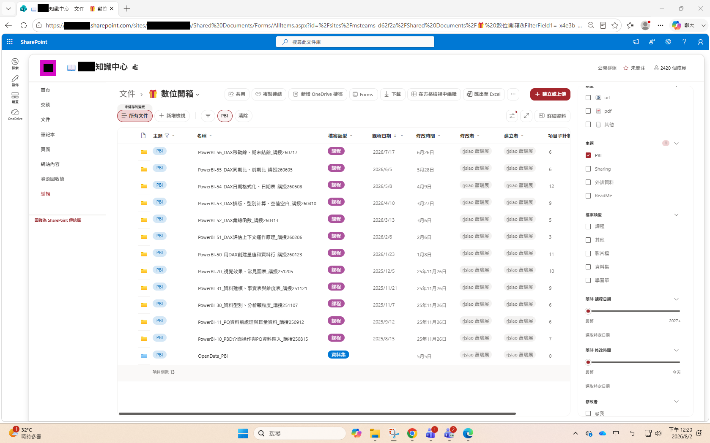
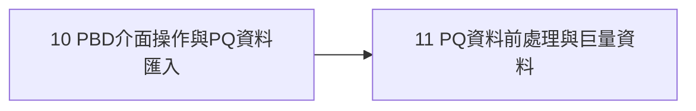

# 📊 BI 資料建模之教育訓練課程

本文件彙整蕭瑞展「商業智慧(BI)」教育訓練課程清單，依照 Power BI 學習路徑排序：從 PBD／Power Query 基礎操作，到資料建模概念，再到 DAX 量值與時間智慧函數，適合作為 BI 建模能力的自學或教學規劃參考。

---

## 📋 目錄

1. [課程總覽](#-課程總覽)
2. [學習路徑建議](#-學習路徑建議)

---

## 📚 課程總覽

| No. | 課程名稱 | 教材日期 | 學習難度 | 分類 | 分享者 | 學習點 |
|----|------|------|------|----|------|------|
| 1 | PowerBI-10_PBD介面操作與PQ資料匯入 | 2025/8/15 | 入門 | BI | 蕭瑞展 | 1. 認識 Power BI Desktop 使用介面與基本操作 2. 理解 PBD、PQ、Power BI Service 三者的轉換與互動關係 3. 學會從 Excel／CSV／TXT 等格式匯入資料 4. 認識 Power Query (PQ) 匯入資料的方式 5. 使用 PQ 管理參數以定義檔案路徑 |
| 2 | PowerBI-11_PQ資料前處理與巨量資料 | 2025/9/12 | 入門／初階 | BI | 蕭瑞展 | 1. 認識商業智慧(BI)與大數據分析的基本概念 2. 比較營運智慧(OI)、商業智慧(BI)與巨量資料的差異 3. 了解 BI 系統架構與資料來源 4. 學習使用 Power Query 進行資料清理與轉換 5. 實作常見的資料前處理技巧 |
| 3 | PowerBI-30_資料型別、分析顆粒度 | 2025/11/7 | 初階 | BI | 蕭瑞展 | 1. 認識並記憶 PQ 與 DAX 中常用的資料型別 2. 理解資料顆粒度(granularity)對分析結果的影響 3. 區分強型別／弱型別、靜態／動態語言的差異(如 DAX、M 語言特性) |
| 4 | PowerBI-31_資料建模、事實表與維度表 | 2025/11/21 | 初階 | BI | 蕭瑞展 | 1. 認識星狀結構(star schema)的資料建模概念 2. 區分事實表(fact table)與維度表(dimension table)的角色 3. 實作資料建模，建立多資料表之間的關聯 |
| 5 | PowerBI-70_視覺效果、常見圖表 | 2025/12/5 | 初階 | BI | 蕭瑞展 | 1. 認識 Power BI 常見的視覺效果(圖表)類型 2. 學習統計圖表的選用方法與應用情境 3. 理解圖表類型與資料特性(比較、相關性、分布、組成)的對應關係 |
| 6 | PowerBI-50_用DAX創建量值和資料行 | 2026/1/23 | 初階 | BI | 蕭瑞展 | 1. 了解 DAX 函數的使用範圍與角色 2. 學習新增量值(measure)的方法 3. 實作新增計算資料行(column)與資料表(table) |
| 7 | PowerBI-51_DAX評估上下文運作原理 | 2026/2/6 | 進階 | BI | 蕭瑞展 | 1. 理解 Power BI 資料更新的時機與必要性 2. 說明上下文(context)與 DAX 表達式之間的關聯 3. 認識列上下文轉換成篩選上下文的機制 |
| 8 | PowerBI-52_DAX彙總函數 | 2026/3/13 | 進階 | BI | 蕭瑞展 | 1. 比較聚合函數(如 SUM)與迭代函數(如 SUMX)的異同 2. 學習使用迭代函數建立量值與新增資料行 3. 掌握 DAX 核心彙總函數的應用情境 |
| 9 | PowerBI-53_DAX排版、型別計算、空值空白 | 2026/4/10 | 初階 | BI | 蕭瑞展 | 1. 學習 DAX 表達式的輸入輸出、格式化與錯誤處理 2. 解析 DAX 常見的型別與運算問題 3. 區分空值、空白、空字串、缺漏值的差異與處理方式 |
| 10 | PowerBI-54_DAX日期格式化、日期表 | 2026/5/8 | 初階 | BI | 蕭瑞展 | 1. 學習建立自訂的日期維度表(date dimension) 2. 將日期維度表與事實表建立關聯 3. 熟悉基本日期時間函數與資料格式化顯示 |
| 11 | PowerBI-55_DAX同期比、前期比 | 2026/6/5 | 進階 | BI | 蕭瑞展 | 1. 釐清比較週期範圍與 DAX 時間智慧函數的關聯 2. 正確套用日期維度表進行前期比、同期比計算 3. 學習 YTD、QTD 等時間智慧函數的應用 |
| 12 | PowerBI-56_DAX移動線、期末結餘 | 2026/7/17 | 進階 | BI | 蕭瑞展 | 1. 複習事實表種類，計算移動平均線(moving average) 2. 學習計算期末結餘(如月結餘、季結餘、年結餘) 3. 強調日期範圍的重要性，分辨時間函數回傳值意義 |

---

## 🗺 學習路徑建議

依課程難度可分為三個階段：

### 1. 🟢 入門

課程 1～2，建立 Power BI Desktop 與 Power Query 的基本操作能力。

### 2. 🟡 初階

課程 3～6、9～10，學習資料型別、星狀結構建模、視覺效果與 DAX 基礎量值。

### 3. 🔴 進階

課程 7～8、11～12，深入 DAX 評估上下文、彙總函數與時間智慧函數的應用。

> 建議依 No. 順序來安排 BI 資料建模的學習，前面初階課程的概念會是後續進階 DAX 課程的先備知識。
