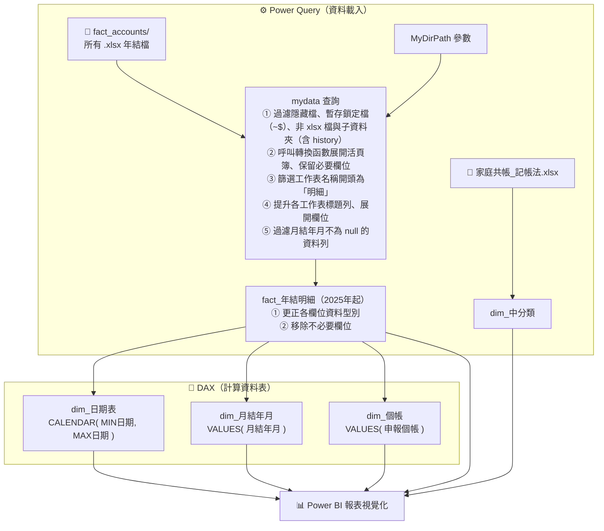
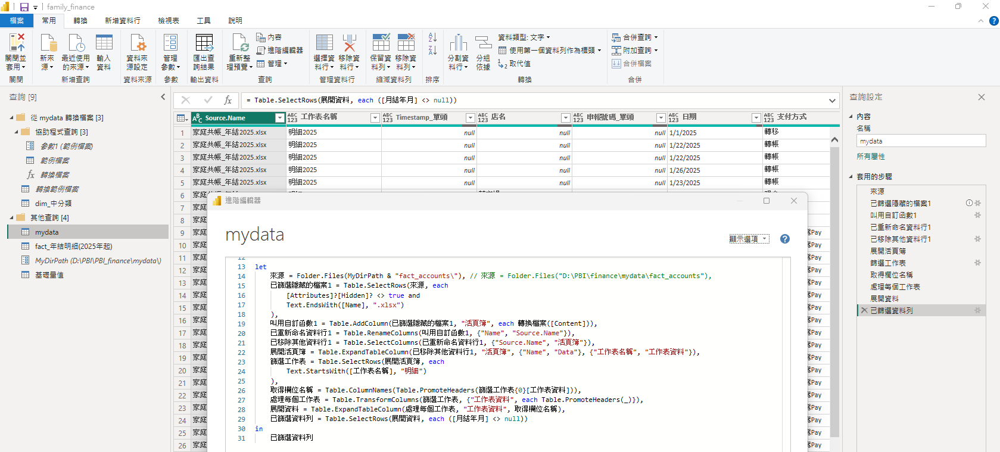
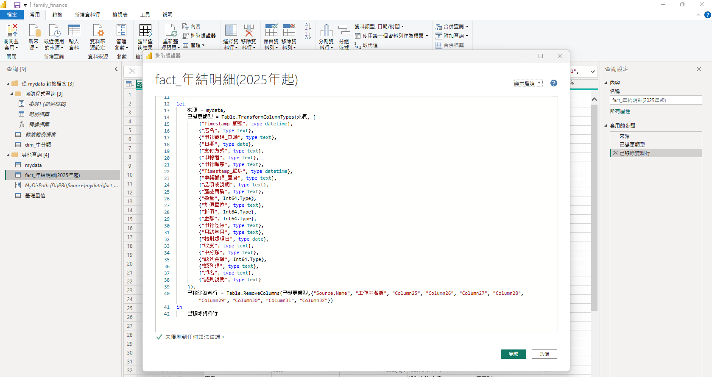
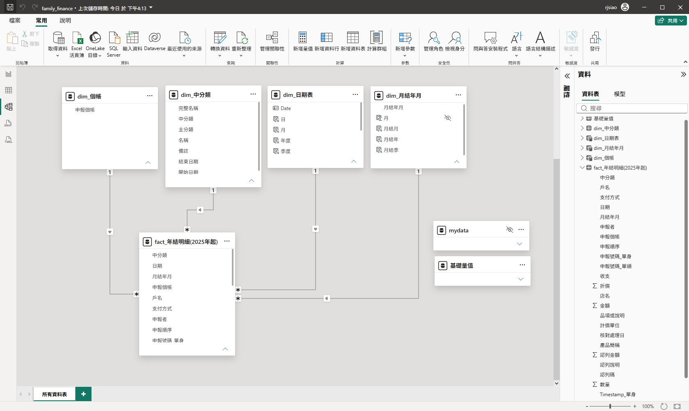
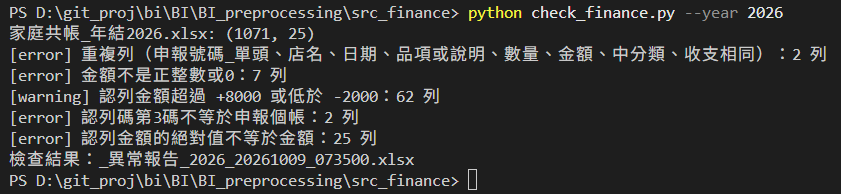
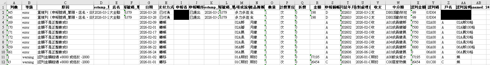
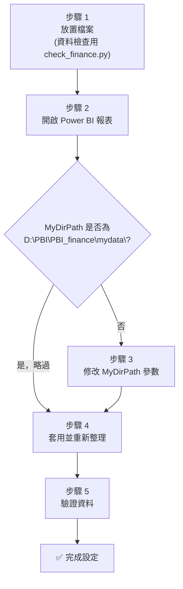
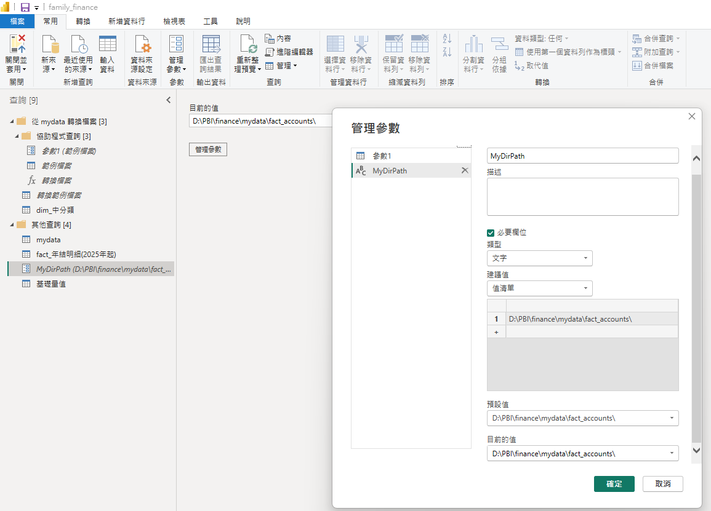
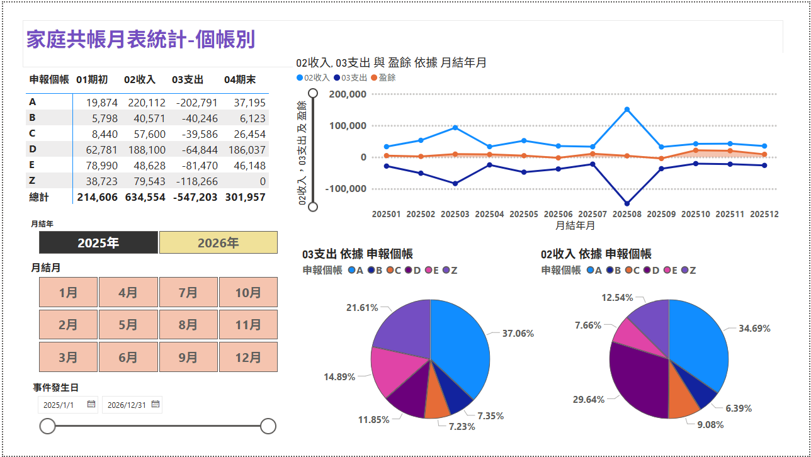
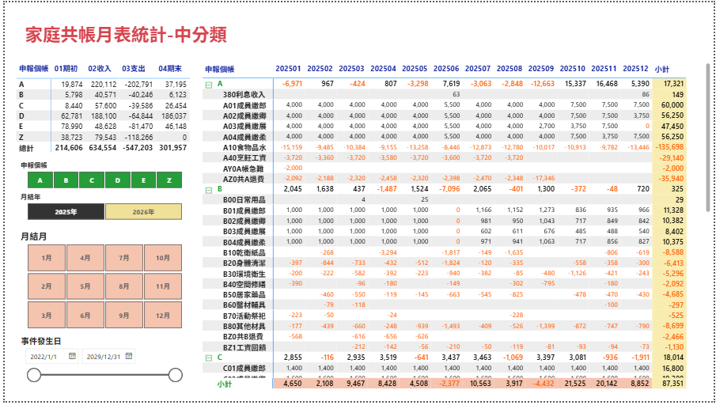

# 🏠 家庭共帳 Power BI 報表說明

本文件說明如何設定與使用 `family_finance.pbix` Power BI 報表，包含檔案結構、ETL 架構原理，以及初次取得檔案後的環境設定步驟。

> 本報表以家庭記帳為出發點，建立「分類維度 + 明細事實」的 Power BI ETL 架構。其中大／中分類的層級編碼（如 A01、B02）與會計科目編制相同概念；移植至製造業時，只需將收支分類替換為料（直接材料）、工（直接人工）、費（製造費用），即可作為實際成本報表的基礎骨架。


---

## 📋 目錄

1. [檔案結構](#-檔案結構)
2. [ETL 架構原理](#️-etl-架構原理)
3. [資料前處理/檢查](#-資料前處理檢查)
4. [初次設定步驟](#-初次設定步驟)
5. [新增年度資料](#-新增年度資料)
6. [常見問題](#-常見問題)

---

## 📁 檔案結構

請將所有檔案放置於同一個根目錄下（以下以 `D:\PBI\PBI_finance\` 為例）：

```
D:\PBI\PBI_finance\
│
├── family_finance.pbix          ← Power BI 報表主檔
├── README.md                    ← 本說明文件
│
├── reference\                   ← 參考資料（備查用，不進入 ETL）
│
└── mydata\                      ← 原始資料根目錄
    ├── dim\                     ← 維度資料（分類對照表）
    │   └── 家庭共帳_記帳法.xlsx
    │
    └── fact_accounts\           ← 帳務事實資料（每年一份）
        ├── 家庭共帳_年結2025.xlsx
        └── 家庭共帳_年結2026.xlsx
```

> **重要**：`fact_accounts\` 資料夾中所有 `.xlsx` 檔案都會被自動讀取，新增年度只需放入新檔案即可。

---

## ⚙️ ETL 架構原理

本報表資料處理分兩個階段：**Power Query** 負責從檔案讀取與轉型，**DAX** 在模型載入後產生計算維度資料表。

### 查詢清單

| 查詢名稱 | 層 | 類型 | 說明 |
|----------|----|------|------|
| MyDirPath | PQ | 參數 | **資料夾路徑參數**（需依本機修改） |
| dim_中分類 | PQ | 載入資料表 | 從 `家庭共帳_記帳法.xlsx` 讀取中分類對照 |
| mydata | PQ | 查詢 | 合併 fact_accounts 資料夾所有 xlsx（未直接載入） |
| fact_年結明細(2025年起) | PQ | 載入資料表 | 轉型後的最終事實資料表（已啟用載入至模型） |
| dim_日期表 | DAX | 計算資料表 | `CALENDAR()` 依事實表日期範圍產生完整日期維度 |
| dim_月結年月 | DAX | 計算資料表 | `VALUES()` 從事實表萃取不重複月結年月 |
| dim_個帳 | DAX | 計算資料表 | `VALUES()` 從事實表萃取不重複申報個帳 |

### 資料流向



### 核心 M 查詢邏輯（mydata）



```m
let
    來源 = Folder.Files(MyDirPath & "fact_accounts\"),
    已篩選隱藏的檔案1 = Table.SelectRows(來源, each
        [Attributes]?[Hidden]? <> true and                 // 使用 ?[Hidden]? 安全導覽，避免屬性欄位不存在時報錯
        Text.EndsWith([Name], ".xlsx") and
        not Text.StartsWith([Name], "~$") and               // 排除 Excel 暫存鎖定檔
        [Folder Path] = MyDirPath & "fact_accounts\"        // 僅保留根目錄檔案，排除任何子資料夾
    ),

    叫用自訂函數1 = Table.AddColumn(已篩選隱藏的檔案1, "活頁簿", each 轉換檔案([Content])),
    已重新命名資料行1 = Table.RenameColumns(叫用自訂函數1, {"Name", "Source.Name"}),
    已移除其他資料行1 = Table.SelectColumns(已重新命名資料行1, {"Source.Name", "活頁簿"}),
    展開活頁簿 = Table.ExpandTableColumn(已移除其他資料行1, "活頁簿",
        {"Name", "Data"}, {"工作表名稱", "工作表資料"}),
    篩選工作表 = Table.SelectRows(展開活頁簿, each
        Text.StartsWith([工作表名稱], "明細")
    ),
    取得欄位名稱 = Table.ColumnNames(                          // 從第一個工作表取得欄位 schema
        Table.PromoteHeaders(篩選工作表{0}[工作表資料])),
    處理每個工作表 = Table.TransformColumns(篩選工作表,
        {"工作表資料", each Table.PromoteHeaders(_)}),          // 對每個工作表個別提升標題列
    展開資料 = Table.ExpandTableColumn(處理每個工作表, "工作表資料", 取得欄位名稱),
    已篩選資料列 = Table.SelectRows(展開資料, each ([月結年月] <> null))
in
    已篩選資料列
```



### 資料模型（Modeling 結果）



---

## 🧹 資料前處理/檢查

年結檔放進 `fact_accounts\` 之前，可以先用 [`check_finance.py`](../BI_preprocessing/src_finance/check_finance.py) 檢查資料內容。Power Query 只會轉型、不會指出哪一列填錯，事先檢查可避免錯誤資料進入報表。(目前採手動執行，屬於 data pipeline 的原型)

### 執行方式

將年結檔放在 `check_finance.py` 同一個資料夾，於該資料夾執行：

```powershell
python -m pip install -r requirements.txt     # 第一次使用時安裝套件 (pandas、openpyxl)

python check_finance.py                        # 檢查整份檔案
python check_finance.py --year 2026            # 只檢查月結年月屬於 2026 年的資料
python check_finance.py --month 202609         # 只檢查 202609
python check_finance.py --month 202607 202609  # 檢查 202607 到 202609
python check_finance.py --file 家庭共帳_年結2026.xlsx --month 202609   # 指定檔案
```

- 未指定 `--file` 時，讀取資料夾中修改日期最新的 xlsx (略過 `~$` 暫存檔及異常報告)。
- 以「月結年月」決定檢查範圍；指定範圍超出資料集的月結年月範圍時會即時停止。
- 使用 `--year` / `--month` 時，月結年月空白或格式錯誤的列會先被篩掉；要檢查這類問題請不帶參數執行。

### 檢查清單

等級說明：❌ **error** 為必須修正的錯誤；⚠️ **warning** 為需要人工確認、不一定是錯誤。

**第一階段：單一欄位內容**

- [ ] **整列空白**：不可有全部欄位都空白的資料列 (❌ error)
- [ ] **重複列**：「申報號碼_單頭、店名、日期、品項或說明、數量、金額、中分類、收支」不可全部相同 (❌ error)
  - 加入「收支」是為了讓銀行轉帳這類一收一支的成對資料不被誤判為重複
- [ ] **月結年月**：必須是 `YYYYMM` 格式，月份介於 01–12 (❌ error)
- [ ] **日期、核對處理日**：必須是有效日期，且不可晚於今天 (❌ error)
  - 可接受 Excel 日期、`YYYY-MM-DD`、`M/D/YYYY` 三種寫法
- [ ] **數量、折價、金額**：必須是正整數或 0，不可空白 (❌ error)
  - 帶千分位逗號的文字 (如 `82,042`) 會先去掉逗號再判斷
- [ ] **中分類**：前 3 碼為英數字、後 4 碼為中文字，例如 `A10食物品水` (❌ error)
- [ ] **收支**：只能是「收」、「支」、「期初」 (❌ error)
- [ ] **申報個帳**：只能是 A、B、C、D、E (❌ error)
- [ ] **認列金額範圍**：超過 +8000 或低於 -2000 時提醒確認 (⚠️ warning)
  - 門檻值定義在程式開頭的 `WARN_AMOUNT_MAX`、`WARN_AMOUNT_MIN`

**第二階段：欄位之間的關係**

- [ ] **認列碼前兩碼**：等於月結年月的末兩碼，例如 202609 → `09xxx` (❌ error)
- [ ] **認列碼第 3 碼**：等於申報個帳，大小寫需一致，例如 `09C01` 的 C (❌ error)
- [ ] **認列碼不跳號**：依「月結年月 + 申報個帳」分組，第 4–5 碼須從 `00` 起連號 (❌ error)
  - 報告會標出缺號後的第一個號碼，並在原因中列出缺了哪幾號
- [ ] **認列金額與金額**：認列金額的絕對值必須等於金額 (❌ error)
  - 同一張單據拆成多列、或總額記在第一列時也會被列出，需人工確認
- [ ] **收支與正負號**：「收」、「期初」的認列金額為正數或 0；「支」的認列金額為 0 或負數 (❌ error)
- [ ] **核對處理日與月結年月**：核對處理日須落在月結年月的當月或前後一個月，例如 202609 → 2026-08-01 至 2026-10-31 (❌ error)

### 檢查結果

- **畫面**：顯示讀取的檔名與資料筆數，以及各項問題的等級、原因、列數；全部通過時顯示「檢查通過，沒有問題列」。

  

- **異常報告**：有問題時在同一資料夾產生 `_異常報告_<範圍>_<時間戳記>.xlsx`
  - 範圍為 `全部`、`YYYY`、`YYYYMM` 或 `YYYYMM-YYYYMM`
  - 欄位為「列數、等級、原因」加上原始資料的所有欄位；「列數」即原始 Excel 的列號，可直接回原檔定位
  - 所有儲存格皆為文字格式，保留申報號碼開頭的 0 等原始寫法

  

> 建議流程：執行檢查 → 依異常報告回原始 Excel 修正所有 ❌ error、確認 ⚠️ warning → 重新執行直到沒有 ❌ error → 再放入 `fact_accounts\` 並重新整理報表。

---

## 🚀 初次設定步驟



### 步驟 1：放置檔案 (資料檢查用 check_finance.py)

依照[檔案結構](#-檔案結構)章節，在本機建立對應資料夾，並將收到的所有檔案放到正確位置：

```
建立資料夾：
  <你的路徑>\mydata\dim\
  <你的路徑>\mydata\fact_accounts\

放置檔案：
  dim\         ← 家庭共帳_記帳法.xlsx
  fact_accounts\ ← 家庭共帳_年結2025.xlsx、家庭共帳_年結2026.xlsx
```

> 年結檔放入 `fact_accounts\` 之前，先依[資料前處理/檢查](#-資料前處理檢查)執行 `check_finance.py`，修正異常報告中的所有 ❌ error 後再放入。

> 建議將根目錄放在 D 槽並依預設結構建立資料夾，使 `MyDirPath` 預設值為 `D:\PBI\PBI_finance\mydata\`，無需額外修改。若使用其他路徑，後續需要修改參數。

### 步驟 2：開啟 Power BI 報表

用 **Power BI Desktop** 開啟 `family_finance.pbix`。

### 步驟 3：修改 MyDirPath 參數



若你的 `MyDirPath` **不是** `D:\PBI\PBI_finance\mydata\`，需要更新參數：

1. 在上方功能列點選「**常用**」→「**轉換資料**」→「**管理參數**」
2. 在左側清單選取 `MyDirPath`
3. 將「**目前的值**」修改為你本機的 `mydata` 資料夾路徑  
   例如：`C:\Users\你的名字\Documents\PBI\PBI_finance\mydata\`
   
   > 路徑結尾必須加上 `\` 反斜線

4. 點選「**確定**」

### 步驟 4：套用並重新整理

1. 在 Power Query 編輯器中點選「**常用**」→「**關閉並套用**」
2. 若出現「隱私權等級」提示，選擇「**忽略隱私等級檢查**」或設為「**組織**」
3. Power BI 會自動讀取所有 xlsx 並匯入資料

### 步驟 5：驗證資料

確認報表中：
- 資料年份涵蓋 2025、2026（或你放入的年度）
- 中分類對照表正確顯示

---

## 📅 新增年度資料

每年只需：

1. 將新的年結 Excel 檔（如 `家庭共帳_年結2027.xlsx`）放入 `mydata\fact_accounts\` 資料夾
2. 在 Power BI Desktop 點選「**重新整理**」（首頁工具列）
3. 新年度資料會自動被讀取合併，無需修改任何查詢

---

## 🖼️ 報表預覽

### 個帳別月表



### 中分類月表



---

## ❓ 常見問題

### Q1：重新整理時出現「找不到路徑」錯誤

**原因**：`MyDirPath` 參數路徑與本機實際路徑不符。  
**解法**：依照[步驟 3](#步驟-3修改-mydirpath-參數) 重新設定路徑。

### Q2：資料表顯示空白或欄位消失

**原因**：Excel 工作表名稱不是以「明細」開頭，或欄位名稱有異動。  
**解法**：確認 xlsx 中的工作表名稱格式，應為「明細YYYY」（如「明細2025」）。

### Q3：出現「公式防火牆」或隱私等級提示

**原因**：Power BI 的資料來源隱私等級保護機制。  
**解法**：
- 點選「**檔案**」→「**選項及設定**」→「**選項**」
- 在「**目前的檔案**」→「**隱私權**」中，勾選「**忽略隱私等級並可能改善效能**」

### Q4：如何確認目前讀取了哪些 xlsx 檔案？

在 Power Query 編輯器中點選 `mydata` 查詢，查看 `Source.Name` 欄位，即可看到所有已載入的檔案名稱。
