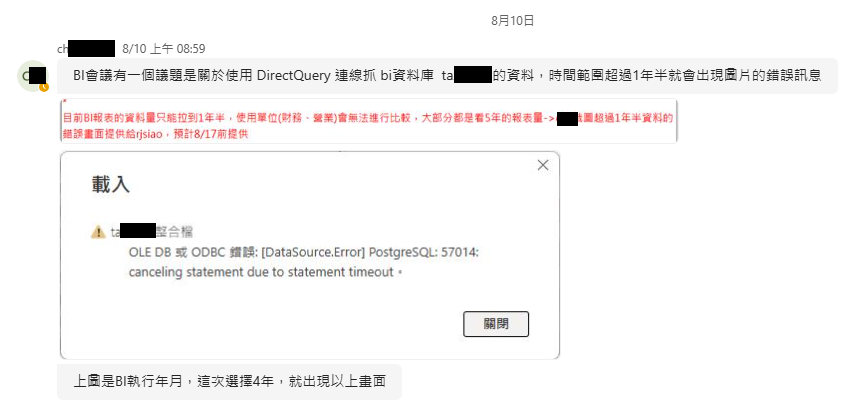
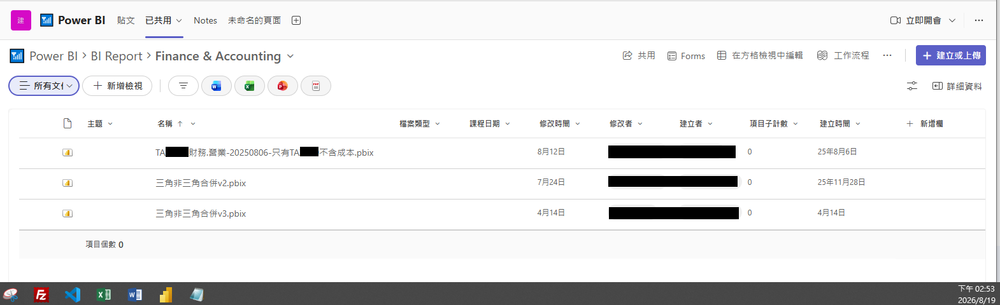
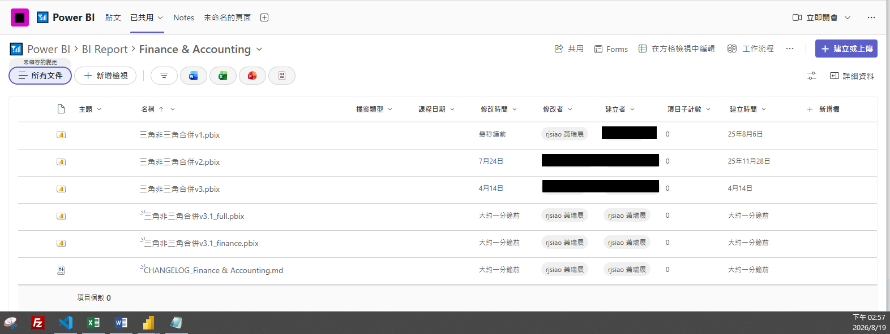
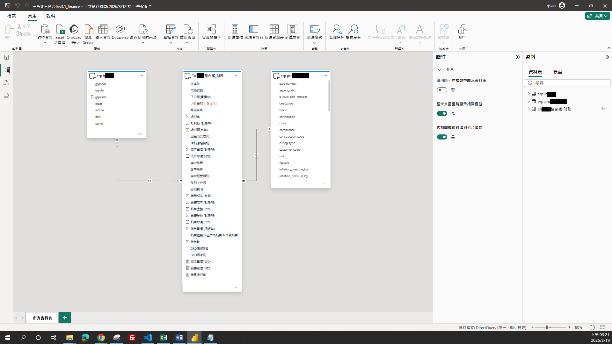

# 📈 三角與非三角合併 Power BI 報表說明

本文件說明「三角與非三角合併」財務會計 Power BI 報表的版本沿革與改善內容，記錄從 v3 版的效能問題到 v3.1 分支版本的優化作法，提供後續維護與交接參考。

---

## 📋 目錄

1. [背景與問題](#-背景與問題)
2. [改善內容](#️-改善內容)
3. [版本與欄位範圍](#-版本與欄位範圍)
4. [命名與版控規則](#️-命名與版控規則)
5. [相關檔案](#-相關檔案)

---

## 🔍 背景與問題

原有的「三角與非三角合併」Power BI 報表（v3 版）透過 PostgreSQL Direct Query 串接財務系統的兩表，但 SQL 查詢語句未帶入篩選條件，導致每次重新整理都會撈取**全部年月、全部子公司**的資料，才在 Power Query 端篩選或加工。

取得完整資料集載入 pbix，造成：

- 時間成本增加 (報表 refresh + SQL 查詢請求)
- 記憶體耗用上升
- 甚至發生查詢逾時（`57014: canceling statement due to statement timeout`），Power BI 報表重新整理不成功

---

## ⚙️ 改善內容

為了縮短 BI 報表整理時間、降低資料庫查詢負擔，將篩選邏輯改為 **源頭篩選（查詢下推）** 於 SQL 端執行，並依部門需求切分欄位範圍：

1. **源頭篩選優化（篩選交給資料庫先做）**
   把年月、公司別等參數組成 SQL 的 `WHERE` 子句，直接用作查詢字串。讓資料庫能用索引在源頭就先篩選好，使 `EnableFolding = true` 真正發揮效果，不再撈取整張表的資料。

2. **建立分支版本（依部門需求各取所需）**
   完整 47 欄位版本（`v3.1_full`）供跨部門使用，財務單位可用 27 欄位版本（`v3.1_finance`），減少開啟報表時重新載入的時間。其餘 20 欄註解保留、非刪除，未來也可隨時復原或擴充。

3. **標上註解分段（提高程式碼可讀性）**
   根據欄位屬性，在 Power Query 內加上段落註解，如維度欄位、銷售數量與金額、產品屬性、銷售型態與單位分類等，讓使用者或工程師排查時，能快速定位每個欄位所屬的類別與意義，降低日後維護與交接的理解成本。

4. **命名與版控規則制定（版本一目了然）**
   制定 `v{主版號}.{次版號}_{欄位模式}.pbix` 命名規則，並建立單一的 CHANGELOG 記錄每版上線日期與改動內容，方便日後交接與追溯。

> **備用（暫不採用）**：此為治標不治本之對策。逾時保護係新增 `CommandTimeout` 設定 10 分鐘，避免因逾時被強制中斷。儘管仍會受 PostgreSQL 資料庫本身逾時設定影響，若持續發生逾時，可能需與資料庫管理者確認伺服器端設定情形。

---

## 📁 版本與欄位範圍

| 版本 | 查詢方式 | 欄位數 | 適用對象 | 備註 |
|------|---------|------|---------|------|
| **v3**  (既有版本) | Direct Query，無篩選條件 | 47 | 全部使用者 | 每次重新整理撈取全部年月、全部子公司，易發生查詢逾時 |
| **v3.1_full**   (營業用) | Direct Query，源頭篩選下推 | 47 | 跨部門 | 完整欄位，供需要全量欄位的單位使用 |
| **v3.1_finance**   (財務用) | Direct Query，源頭篩選下推 | 27 | 財務單位 | 僅保留財務常用欄位，其餘 20 欄以註解保留非刪除 |

---

## 🏷️ 命名與版控規則

- 檔名格式：`v{主版號}.{次版號}_{欄位模式}.pbix`
  例：`v3.1_full.pbix`、`v3.1_finance.pbix`
- 所有版本共用單一 **CHANGELOG**，記錄每版上線日期與改動內容，避免版本分散難以追溯。

