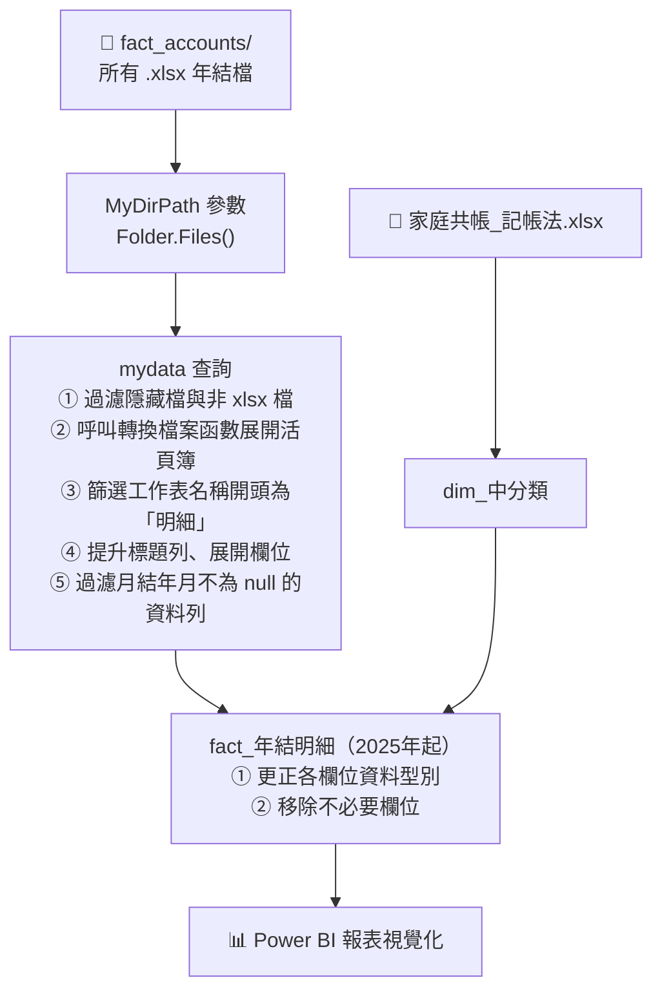
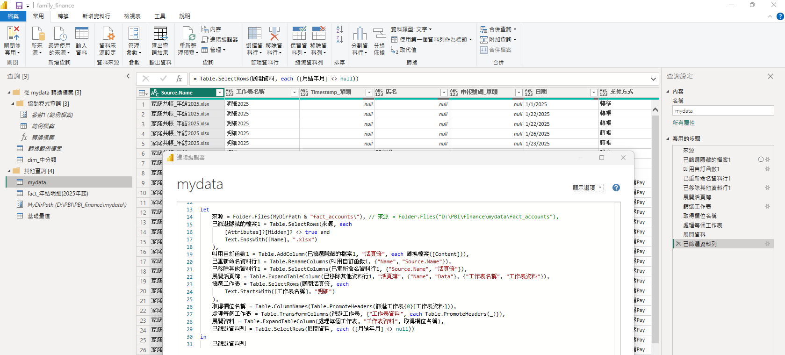
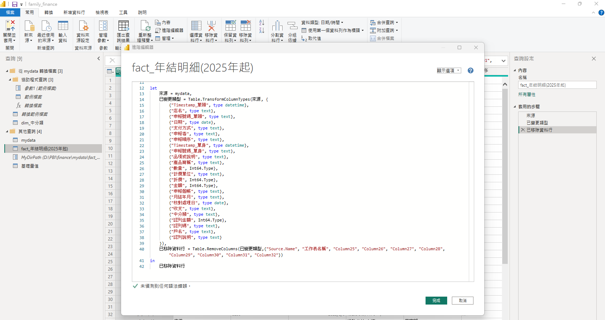
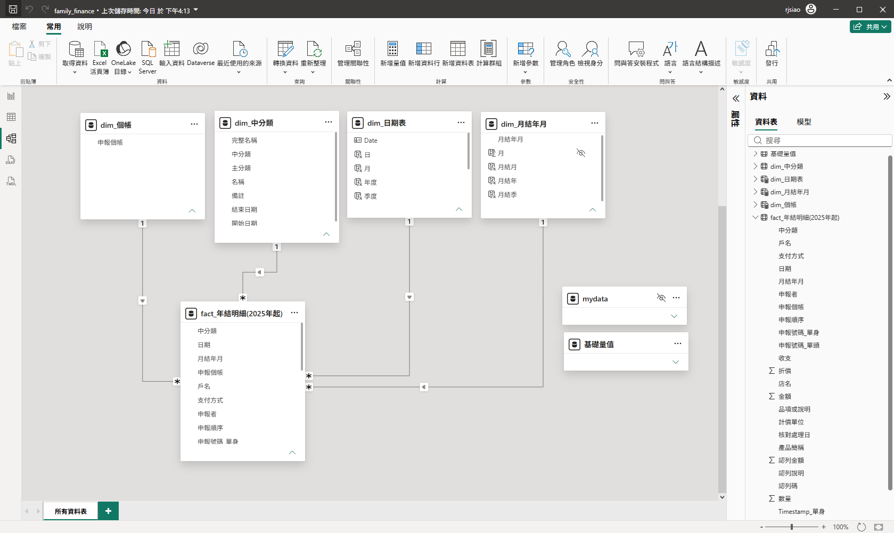
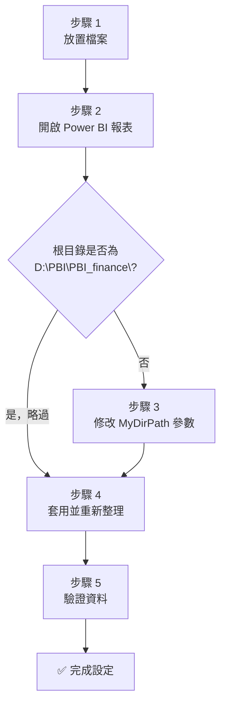
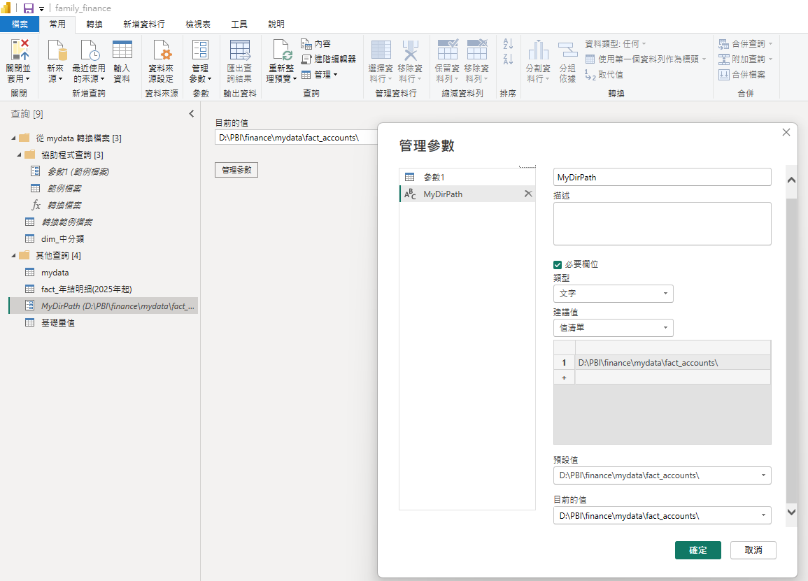
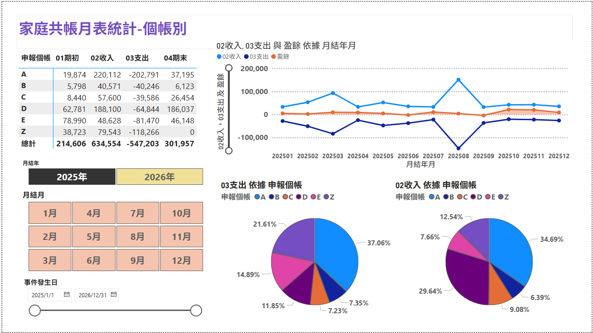
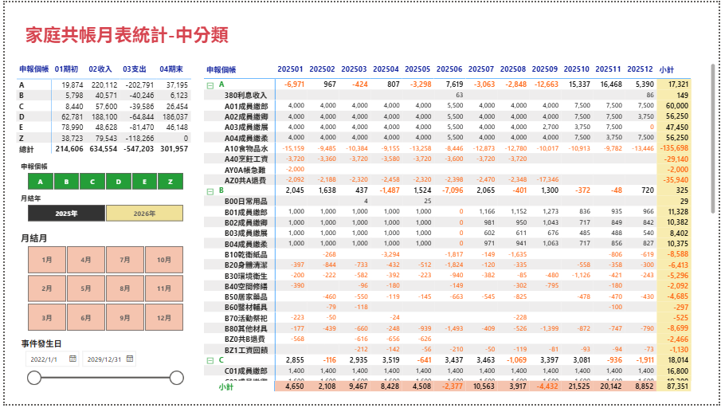

# 🏠 家庭共帳 Power BI 報表說明

本文件說明如何設定與使用 `family_finance.pbix` Power BI 報表，包含檔案結構、ETL 架構原理，以及初次取得檔案後的環境設定步驟。

> 本報表以家庭記帳為出發點，建立「分類維度 + 明細事實」的 Power BI ETL 架構。其中大／中分類的層級編碼（如 A01、B02）與會計科目編制相同概念；移植至製造業時，只需將收支分類替換為料（直接材料）、工（直接人工）、費（製造費用），即可作為實際成本報表的基礎骨架。


---

## 📋 目錄

1. [檔案結構](#-檔案結構)
2. [ETL 架構原理](#-etl-架構原理)
3. [初次設定步驟](#-初次設定步驟)
4. [新增年度資料](#-新增年度資料)
5. [常見問題](#-常見問題)

---

## 📁 檔案結構

請將所有檔案放置於同一個根目錄下（以下以 `D:\PBI\PBI_finance\` 為例）：

```
D:\PBI\PBI_finance\
│
├── family_finance.pbix          ← Power BI 報表主檔
├── README.md                    ← 本說明文件
│
├── reference\                   ← 參考資料（備查用，不進入 ETL）
│
└── mydata\                      ← 原始資料根目錄
    ├── dim\                     ← 維度資料（分類對照表）
    │   └── 家庭共帳_記帳法.xlsx
    │
    └── fact_accounts\           ← 帳務事實資料（每年一份）
        ├── 家庭共帳_年結2025.xlsx
        └── 家庭共帳_年結2026.xlsx
```

> **重要**：`fact_accounts\` 資料夾中所有 `.xlsx` 檔案都會被自動讀取，新增年度只需放入新檔案即可。

---

## ⚙️ ETL 架構原理

本報表使用 Power Query（M 語言）實作 ETL，共有 9 個查詢，分三層：

### 查詢清單

| 查詢名稱 | 類型 | 說明 |
|----------|------|------|
| MyDirPath | 參數 | **資料夾路徑參數**（需依本機修改） |
| dim_中分類 | 查詢 | 從 `家庭共帳_記帳法.xlsx` 讀取中分類對照 |
| mydata | 查詢 | 合併 fact_accounts 資料夾所有 xlsx |
| fact_年結明細(2025年起) | 資料表 | 轉型後的最終事實資料表 |

### 資料流向



### 核心 M 查詢邏輯（mydata）



```m
let
    來源 = Folder.Files(MyDirPath),
    已篩選隱藏的檔案 = Table.SelectRows(來源, each
        [Attributes]?[Hidden] <> true and
        Text.EndsWith([Name], ".xlsx")
    ),
    叫用自訂函數 = Table.AddColumn(已篩選隱藏的檔案, "活頁簿",
        each 轉換檔案([Content])),
    ...
    篩選工作表 = Table.SelectRows(展開活頁簿, each
        Text.StartsWith([工作表名稱], "明細")
    ),
    ...
    已篩選資料列 = Table.SelectRows(展開資料, each ([月結年月] <> null))
in
    已篩選資料列
```



### 資料模型（Modeling 結果）



---

## 🚀 初次設定步驟



### 步驟 1：放置檔案

依照[檔案結構](#-檔案結構)章節，在本機建立對應資料夾，並將收到的所有檔案放到正確位置：

```
建立資料夾：
  <你的路徑>\mydata\dim\
  <你的路徑>\mydata\fact_accounts\

放置檔案：
  dim\         ← 家庭共帳_記帳法.xlsx
  fact_accounts\ ← 家庭共帳_年結2025.xlsx、家庭共帳_年結2026.xlsx
```

> 建議將根目錄放在 D 槽（例如 `D:\PBI\PBI_finance\`）以符合預設參數設定，無需額外修改。若使用其他路徑（如 `C:\Users\你的名字\Documents\PBI\finance\`），後續需要修改參數。

### 步驟 2：開啟 Power BI 報表

用 **Power BI Desktop** 開啟 `family_finance.pbix`。

### 步驟 3：修改 MyDirPath 參數



若你的根目錄**不是** `D:\PBI\PBI_finance\`，需要更新參數：

1. 在上方功能列點選「**常用**」→「**轉換資料**」→「**管理參數**」
2. 在左側清單選取 `MyDirPath`
3. 將「**目前的值**」修改為你本機的 `fact_accounts` 資料夾路徑  
   例如：`C:\Users\你的名字\Documents\PBI\finance\mydata\fact_accounts\`
   
   > 路徑結尾必須加上 `\` 反斜線

4. 點選「**確定**」

### 步驟 4：套用並重新整理

1. 在 Power Query 編輯器中點選「**常用**」→「**關閉並套用**」
2. 若出現「隱私權等級」提示，選擇「**忽略隱私等級檢查**」或設為「**組織**」
3. Power BI 會自動讀取所有 xlsx 並匯入資料

### 步驟 5：驗證資料

確認報表中：
- 資料年份涵蓋 2025、2026（或你放入的年度）
- 中分類對照表正確顯示

---

## 📅 新增年度資料

每年只需：

1. 將新的年結 Excel 檔（如 `家庭共帳_年結2027.xlsx`）放入 `mydata\fact_accounts\` 資料夾
2. 在 Power BI Desktop 點選「**重新整理**」（首頁工具列）
3. 新年度資料會自動被讀取合併，無需修改任何查詢

---

## 🖼️ 報表預覽

### 個帳別月表



### 中分類月表



---

## ❓ 常見問題

### Q1：重新整理時出現「找不到路徑」錯誤

**原因**：`MyDirPath` 參數路徑與本機實際路徑不符。  
**解法**：依照[步驟 3](#步驟-3修改-mydirpath-參數) 重新設定路徑。

### Q2：資料表顯示空白或欄位消失

**原因**：Excel 工作表名稱不是以「明細」開頭，或欄位名稱有異動。  
**解法**：確認 xlsx 中的工作表名稱格式，應為「明細YYYY」（如「明細2025」）。

### Q3：出現「公式防火牆」或隱私等級提示

**原因**：Power BI 的資料來源隱私等級保護機制。  
**解法**：
- 點選「**檔案**」→「**選項及設定**」→「**選項**」
- 在「**目前的檔案**」→「**隱私權**」中，勾選「**忽略隱私等級並可能改善效能**」

### Q4：如何確認目前讀取了哪些 xlsx 檔案？

在 Power Query 編輯器中點選 `mydata` 查詢，查看 `Source.Name` 欄位，即可看到所有已載入的檔案名稱。
